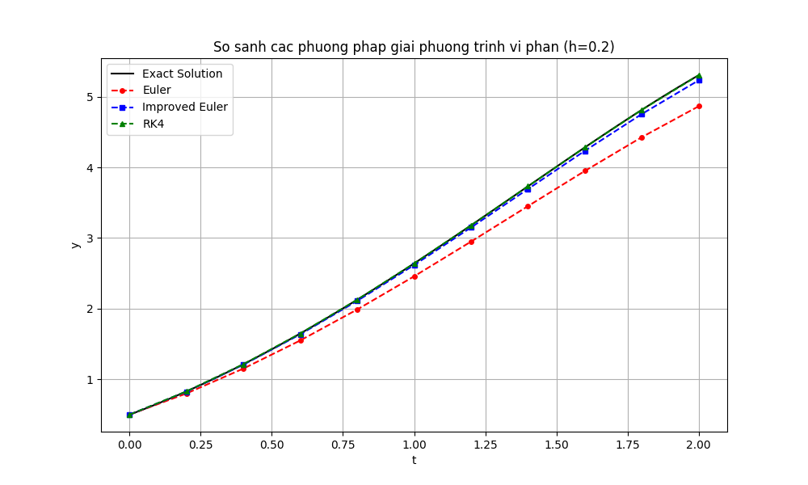
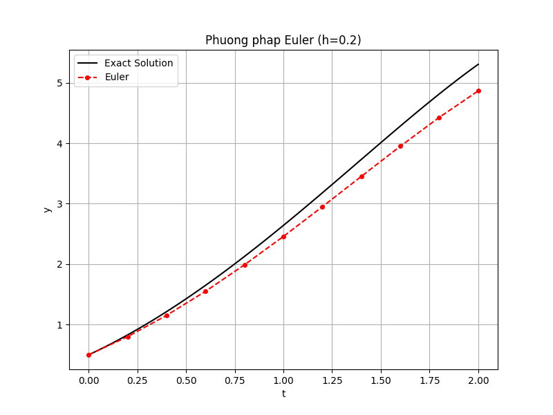
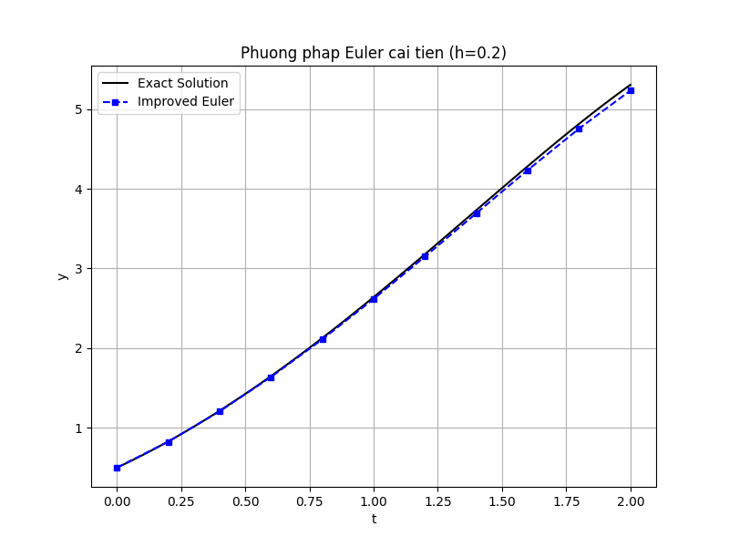
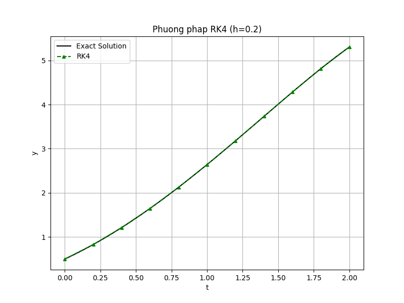

# BÁO CÁO: GIẢI PHƯƠNG TRÌNH VI PHÂN THƯỜNG BẰNG PHƯƠNG PHÁP SỐ

Tài liệu này tổng hợp đầy đủ lý thuyết, cách cài đặt và kết quả thực nghiệm cho các phương pháp giải phương trình vi phân thường (ODE).

## 1. Bài toán
Giải phương trình vi phân thường dạng:
$$
\begin{cases}
y' = f(x, y) \\
y(x_0) = y_0
\end{cases}
$$
Tìm giá trị của hàm $y(x)$ tại các điểm $x_1, x_2, \dots, x_n$.

---

## 2. Các Phương pháp & Cài đặt (Source Code)

Mã nguồn được lưu trong file [`solvers.py`](./solvers.py).

### 2.1. Phương pháp Euler
Đây là phương pháp đơn giản nhất (bậc 1), dựa trên xấp xỉ đạo hàm bằng sai phân.

**Công thức:**
$$y_{n+1} = y_n + h \cdot f(x_n, y_n)$$

**Đánh giá:** Sai số cục bộ $O(h^2)$, sai số toàn cục $O(h)$. Độ chính xác thấp.

### 2.2. Phương pháp Euler cải tiến (Improved Euler / Heun)
Phương pháp này thuộc nhóm Predictor-Corrector (Dự báo - Hiệu chỉnh), bậc 2.

**Công thức:**
1. Dự báo: $\tilde{y}_{n+1} = y_n + h \cdot f(x_n, y_n)$
2. Hiệu chỉnh: $y_{n+1} = y_n + \frac{h}{2} [f(x_n, y_n) + f(x_{n+1}, \tilde{y}_{n+1})]$

**Đánh giá:** Sai số toàn cục $O(h^2)$. Chính xác hơn Euler thường.

### 2.3. Phương pháp Runge-Kutta bậc 4 (RK4)
Phương pháp phổ biến nhất vì cân bằng giữa độ chính xác và khối lượng tính toán.

**Công thức:**
$$y_{n+1} = y_n + \frac{h}{6}(k_1 + 2k_2 + 2k_3 + k_4)$$
Trong đó:
- $k_1 = f(x_n, y_n)$
- $k_2 = f(x_n + \frac{h}{2}, y_n + \frac{h}{2}k_1)$
- $k_3 = f(x_n + \frac{h}{2}, y_n + \frac{h}{2}k_2)$
- $k_4 = f(x_n + h, y_n + h k_3)$

**Đánh giá:** Sai số toàn cục $O(h^4)$. Độ chính xác rất cao.

---

## 3. Thực nghiệm và Đánh giá

### 3.1. Thiết lập bài toán mẫu
Chúng ta giải phương trình sau để kiểm chứng:
- **Phương trình:** $y' = y - t^2 + 1$
- **Miền tính toán:** $0 \le t \le 2$
- **Điều kiện đầu:** $y(0) = 0.5$
- **Nghiệm chính xác:** $y(t) = (t+1)^2 - 0.5e^t$
- **Bước nhảy:** $h=0.2$

### 3.2. Kết quả tính toán
(Kết quả trích xuất từ chương trình `main.py`)

| t | Chính xác (Exact) | Euler (Err) | Euler Cải tiến (Err) | RK4 (Err) |
|---|-------------------|-------------|----------------------|-----------|
| 0.0 | 0.500000 | 0.500000 (0.000) | 0.500000 (0.000) | 0.500000 (0.000) |
| 0.2 | 0.829299 | 0.800000 (0.029) | 0.828000 (0.001) | 0.829293 (0.000005) |
| ... | ... | ... | ... | ... |
| 2.0 | 5.305472 | 4.865784 (0.439) | 5.300348 (0.005) | 5.305363 (0.000109) |

**Nhận xét:**
- **Euler** sai lệch khá nhiều khi $t$ tăng (lên đến ~0.44 tại t=2.0).
- **Euler cải tiến** giảm sai số đáng kể (chỉ còn ~0.005).
- **RK4** cho kết quả gần như trùng khớp hoàn toàn (sai số ~0.0001).

### 3.3. Biểu đồ so sánh
#### a) Tổng hợp (Comparison)
Hình ảnh dưới đây minh họa đường đi của các nghiệm xấp xỉ so với nghiệm chính xác:



#### b) Chi tiết từng phương pháp (vs Exact Solution)

**Phương pháp Euler:**

*Nhận xét: Đường xấp xỉ (đỏ) lệch xa dần so với đường chính xác (đen).*

**Phương pháp Euler cải tiến:**

*Nhận xét: Đường xấp xỉ (xanh dương) bám sát hơn, nhưng vẫn có sai số nhỏ ở cuối.*

**Phương pháp Runge-Kutta 4:**

*Nhận xét: Đường xấp xỉ (xanh lá) trùng khít hoàn toàn với đường chính xác.*

---

## 4. Hướng dẫn chạy chương trình

### Yêu cầu
Cài đặt thư viện:
```bash
pip install numpy matplotlib pandas
```

### Chạy code
Mở terminal tại thư mục dự án (`d:\viphan`) và chạy:

```bash
python main.py
```

Kết quả sẽ hiển thị bảng sai số chi tiết và lưu file ảnh đồ thị `comparison_plot.png`.
